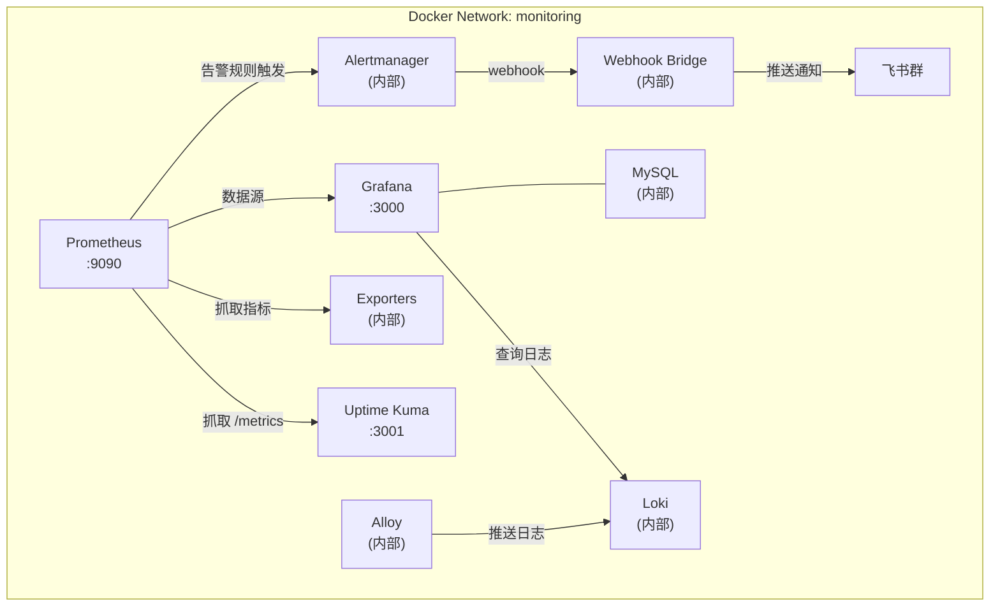

# Docker 生产级监控体系

基于 Docker Compose 的一站式监控解决方案，涵盖指标采集、日志聚合、可视化、告警管理与服务可用性监控。

## 架构概览



**包含组件：**

| 组件 | 用途 |
|------|------|
| Prometheus | 指标采集与时序数据存储 |
| Alertmanager | 告警去重、分组与路由 |
| Webhook Bridge | Alertmanager → 飞书告警转发（[独立项目](https://github.com/klaus-zzz/webhook-bridge)） |
| Loki | 轻量级日志聚合 |
| Alloy | Docker 容器日志自动采集 |
| Grafana | 统一可视化仪表盘（MySQL 后端） |
| Uptime Kuma | 服务可用性与正常运行时间监控（Prometheus 抓取其 /metrics 指标） |
| Node Exporter | 宿主机系统指标采集 |
| cAdvisor | 容器资源使用指标采集 |
| Blackbox Exporter | HTTP/TCP/ICMP 黑盒探测 |
| Pushgateway | 短生命周期任务指标推送 |

## 前置要求

- Docker Engine 20.10+
- Docker Compose v2.x+
- 建议最低配置：4 核 CPU / 8GB 内存 / 50GB 磁盘

## 快速开始

### 1. 克隆项目并进入目录

```bash
cd monitor
```

### 2. 创建并编辑环境变量文件

```bash
cp .env.example .env
```

**务必修改以下关键密码：**

```dotenv
# MySQL root 密码
MYSQL_ROOT_PASSWORD=your_strong_password_here

# Grafana 管理员密码
GF_SECURITY_ADMIN_PASSWORD=your_strong_password_here
```

如需配置告警通知渠道，填写 `FEISHU_WEBHOOK_URL`（详见[环境变量说明](#环境变量说明)）。

> **Uptime Kuma 认证说明：** Prometheus 需要抓取 Uptime Kuma 的 `/metrics` 端点获取监控指标。认证信息（用户名/密码）写在 `config/prometheus/prometheus.yml` 的 `uptime-kuma` job 中。如修改了 Uptime Kuma 的登录密码，请同步更新该配置文件中的 `basic_auth` 部分。

### 3. 启动所有服务

```bash
docker compose up -d
```

等待约 1-2 分钟，所有服务完成健康检查后即可使用。查看服务状态：

```bash
docker compose ps
```

## 服务访问地址

| 服务 | 地址 | 默认端口 | 说明 |
|------|------|----------|------|
| Grafana | `http://<宿主机IP>:3000` | 3000 | 用户名 `admin`，密码见 `.env` 中 `GF_SECURITY_ADMIN_PASSWORD` |
| Prometheus | `http://<宿主机IP>:9090` | 9090 | 指标查询与告警规则管理 |
| Uptime Kuma | `http://<宿主机IP>:3001` | 3001 | 首次访问需创建管理员账户 |

> 以下服务仅在 Docker 内部网络（monitoring）中可访问，不对外暴露：
> Alertmanager(:9093)、Loki(:3100)、Webhook Bridge(:5000)、Pushgateway(:9091)、cAdvisor(:8080)、Blackbox Exporter(:9115)、MySQL(:3306)

## 环境变量说明

### 镜像版本

| 变量 | 默认值 | 说明 |
|------|--------|------|
| `PROMETHEUS_VERSION` | v3.10.0 | Prometheus 版本 |
| `ALERTMANAGER_VERSION` | v0.31.1 | Alertmanager 版本 |
| `LOKI_VERSION` | 3.6.7 | Loki 版本 |
| `ALLOY_VERSION` | v1.14.0 | Grafana Alloy 版本 |
| `GRAFANA_VERSION` | 12.4.1 | Grafana 版本 |
| `MYSQL_VERSION` | 8.0 | MySQL 版本 |
| `UPTIME_KUMA_VERSION` | 2 | Uptime Kuma 版本 |
| `PUSHGATEWAY_VERSION` | v1.11.2 | Pushgateway 版本 |
| `NODE_EXPORTER_VERSION` | v1.10.2 | Node Exporter 版本 |
| `CADVISOR_VERSION` | v0.56.2 | cAdvisor 版本 |
| `BLACKBOX_EXPORTER_VERSION` | v0.28.0 | Blackbox Exporter 版本 |

### 端口配置

| 变量 | 默认值 | 说明 |
|------|--------|------|
| `GRAFANA_PORT` | 3000 | Grafana Web 端口 |
| `UPTIME_KUMA_PORT` | 3001 | Uptime Kuma Web 端口 |
| `PROMETHEUS_PORT` | 9090 | Prometheus Web 端口 |

### 核心配置

| 变量 | 默认值 | 说明 |
|------|--------|------|
| `MYSQL_ROOT_PASSWORD` | please_change_me | MySQL root 密码（**必须修改**） |
| `MYSQL_DATABASE` | grafana | Grafana 使用的数据库名 |
| `GF_SECURITY_ADMIN_PASSWORD` | please_change_me | Grafana 管理员密码（**必须修改**） |
| `PROMETHEUS_RETENTION_DAYS` | 15d | Prometheus 数据保留时间 |
| `LOKI_RETENTION_PERIOD` | 720h | Loki 日志保留时间（720h = 30 天） |

### 飞书告警通知

| 变量 | 说明 |
|------|------|
| `FEISHU_WEBHOOK_URL` | 飞书机器人 Webhook 地址（必填） |
| `FEISHU_SECRET` | 飞书机器人加签密钥（可选） |

## 可选组件

### Docker Engine Metrics（Docker 守护进程指标）

Docker Engine 可以暴露自身的运行指标供 Prometheus 采集。

**启用步骤：**

1. 编辑 Docker 守护进程配置文件 `/etc/docker/daemon.json`：

```json
{
  "metrics-addr": "127.0.0.1:9323"
}
```

> Docker 23.0+ 无需开启 `experimental` 即可使用 metrics 功能。

2. 重启 Docker 守护进程：

```bash
sudo systemctl restart docker
```

3. 在 `config/prometheus/prometheus.yml` 的 `scrape_configs` 中取消注释 `docker-engine` 相关配置：

```yaml
  - job_name: "docker-engine"
    static_configs:
      - targets: ["host.docker.internal:9323"]
```

> Linux 环境下如果 `host.docker.internal` 不可用，可替换为宿主机的实际 IP 地址或使用 `172.17.0.1`（Docker 默认网桥网关）。

4. 重载 Prometheus 配置：

```bash
# 方式一：通过 API 热重载
curl -X POST http://localhost:9090/-/reload

# 方式二：重启容器
docker compose restart prometheus
```

## 常见问题排查

### Grafana 启动失败，提示数据库连接错误

**原因：** MySQL 尚未完成初始化，Grafana 已尝试连接。

**解决：**
```bash
# 检查 MySQL 健康状态
docker compose ps mysql

# 如果 MySQL 状态为 unhealthy，查看日志
docker compose logs mysql

# 等待 MySQL 就绪后重启 Grafana
docker compose restart grafana
```

### Prometheus 告警规则不生效

Prometheus 内置以下告警规则组：
- **主机告警** — CPU、内存、磁盘使用率及磁盘 IO
- **容器告警** — 容器频繁重启、CPU/内存使用率
- **可用性告警** — 监控目标不可达
- **Uptime Kuma 告警** — 监控目标异常、响应过慢、SSL 证书即将过期
- **Prometheus 自身告警** — 配置重载失败、TSDB 压缩失败、规则评估失败

**排查步骤：**
```bash
# 1. 检查 Prometheus 是否加载了规则文件
curl http://localhost:9090/api/v1/rules

# 2. 查看 Prometheus 日志中是否有规则加载错误
docker compose logs prometheus | grep -i "error"

# 3. 热重载配置
curl -X POST http://localhost:9090/-/reload
```

### Alloy 无法采集容器日志

**原因：** Docker Socket 权限问题或 Loki 未就绪。

**解决：**
```bash
# 1. 确认 Docker Socket 挂载正确
docker compose logs alloy

# 2. 确认 Loki 已就绪（Alloy 依赖 Loki 健康检查）
docker compose ps loki

# 3. 如果 Loki 未就绪，重启 Alloy
docker compose restart alloy
```

### 告警通知未发送到飞书

**排查步骤：**
```bash
# 1. 确认 webhook-bridge 运行正常
docker compose ps webhook-bridge

# 2. 检查 .env 中 FEISHU_WEBHOOK_URL 是否正确配置

# 3. 查看 webhook-bridge 日志
docker compose logs webhook-bridge

# 4. 手动发送测试告警（通过容器内部访问 Alertmanager）
docker exec alertmanager wget \
  --post-data='[{"labels":{"alertname":"test","severity":"warning","instance":"test:9090"},"annotations":{"summary":"test","description":"test alert"}}]' \
  --header='Content-Type: application/json' \
  -qO- http://localhost:9093/api/v2/alerts
```

### 自定义飞书告警卡片模板

告警卡片的样式通过 `config/webhook-bridge/template.json` 配置，修改后无需重建容器，下次告警触发时自动生效（模板文件以只读方式挂载，每次请求重新加载）。

卡片使用飞书 `lark_md` 格式渲染，支持 `**粗体**`、`<font color='red'>颜色文字</font>`、`[超链接](url)` 等富文本样式。

**模板结构说明：**

```json
{
  "firing": {
    "header_color": "red",
    "header_title": "⚠ {{project_name}} 环境异常告警",
    "fields": [
      "**告警名称：** <font color='red'>{{summary}}</font>",
      "**告警类型：** {{status}}",
      "**告警级别：** {{severity}}",
      "**开始时间：** {{starts_at}}",
      "**结束时间：** {{ends_at}}",
      "**故障位置：** {{source}}",
      "**故障描述：** <font color='red'>{{description}}</font>"
    ]
  },
  "resolved": {
    "header_color": "green",
    "header_title": "✅ {{project_name}} 环境恢复信息",
    "fields": [
      "**告警名称：** <font color='green'>{{summary}}</font>",
      "**告警类型：** {{status}}",
      "**告警级别：** {{severity}}",
      "**开始时间：** {{starts_at}}",
      "**结束时间：** {{ends_at}}",
      "**故障位置：** {{source}}",
      "**恢复故障：** <font color='green'>{{description}}</font>"
    ]
  },
  "project_name": "监控系统",
  "links": {
    "grafana": { "text": "grafana", "url": "http://your-grafana:3000" },
    "alertmanager": { "text": "alertmanager", "url": "http://your-alertmanager:9093" },
    "prometheus": { "text": "prometheus", "url": "http://your-prometheus:9090" }
  },
  "note": "PrometheusAlert"
}
```

**可用模板变量：**

| 变量 | 说明 |
|------|------|
| `{{project_name}}` | 环境/项目名称（顶层 `project_name` 字段） |
| `{{alertname}}` | 告警规则名称（英文，来自 labels） |
| `{{summary}}` | 告警摘要（中文，来自 annotations，回退到 alertname） |
| `{{status}}` | 告警状态（firing / resolved） |
| `{{severity}}` | 告警级别 |
| `{{source}}` | 告警来源（instance 或容器名） |
| `{{description}}` | 告警描述 |
| `{{starts_at}}` | 开始时间（已转为东八区） |
| `{{ends_at}}` | 结束时间 |

**卡片颜色可选值：** `blue`、`red`、`orange`、`green`、`purple`、`indigo`、`grey`

**links 配置说明：** 配置了 `url` 的链接会渲染为蓝色可点击超链接，未配置 `url` 的显示为粗体文本。

### 容器日志占用磁盘空间过大

本项目已为所有容器配置日志轮转（单文件最大 10MB，最多保留 3 个文件）。如果宿主机上其他容器未配置日志轮转，可全局设置：

```bash
# 编辑 /etc/docker/daemon.json
{
  "log-driver": "json-file",
  "log-opts": {
    "max-size": "10m",
    "max-file": "3"
  }
}
```

### 如何查看所有服务的健康状态

```bash
# 查看所有服务状态（含健康检查结果）
docker compose ps

# 查看特定服务日志
docker compose logs -f <服务名>

# 查看所有服务日志（最近 100 行）
docker compose logs --tail=100
```

### 如何完全清除数据重新开始

```bash
# 停止所有服务
docker compose down

# 删除所有持久化数据（谨慎操作）
rm -rf ./data

# 重新启动
docker compose up -d
```

## 目录结构

```
monitor/
├── .env.example                          # 环境变量模板
├── .env                                  # 实际环境变量（不纳入版本控制）
├── .gitignore
├── docker-compose.yml                    # Docker Compose 编排文件
├── validate.sh                           # 配置文件验证脚本
├── README.md                             # 本文档
├── config/
│   ├── prometheus/
│   │   ├── prometheus.yml                # Prometheus 主配置
│   │   └── rules/
│   │       └── alert-rules.yml           # 告警规则
│   ├── alertmanager/
│   │   └── alertmanager.yml              # Alertmanager 配置
│   ├── loki/
│   │   ├── loki-config.yml               # Loki 配置
│   │   └── rules/                        # Loki 告警规则
│   ├── alloy/
│   │   └── config.alloy                  # Alloy 采集配置（River 语法）
│   ├── blackbox/
│   │   └── blackbox.yml                  # Blackbox Exporter 探测模块配置
│   ├── webhook-bridge/
│   │   └── template.json                # 飞书告警卡片模板（可自定义）
│   └── grafana/
│       └── provisioning/
│           └── datasources/
│               └── datasources.yml       # Grafana 数据源自动配置
└── data/                                 # 持久化数据目录（自动创建，不纳入版本控制）
    ├── prometheus/
    ├── alertmanager/
    ├── loki/
    ├── grafana/
    ├── mysql/
    ├── uptime-kuma/
    └── pushgateway/
```

## 配置文件验证

项目提供了 `validate.sh` 脚本，可一键验证所有关键配置文件的语法正确性：

```bash
# 运行验证脚本
./validate.sh
```

验证项目包括：
- `docker-compose.yml` — 通过 `docker compose config` 验证
- `prometheus.yml` — 通过 `promtool check config` 验证
- `alert-rules.yml` — 通过 `promtool check rules` 验证
- `alertmanager.yml` — 通过 `amtool check-config` 验证

> 脚本通过 Docker 镜像运行 `promtool` 和 `amtool`，无需在宿主机上额外安装这些工具。

## 常用运维命令

```bash
# 启动所有服务
docker compose up -d

# 停止所有服务
docker compose down

# 查看服务状态
docker compose ps

# 查看实时日志
docker compose logs -f

# 重启单个服务
docker compose restart <服务名>

# 更新镜像并重建
docker compose pull && docker compose up -d
```
